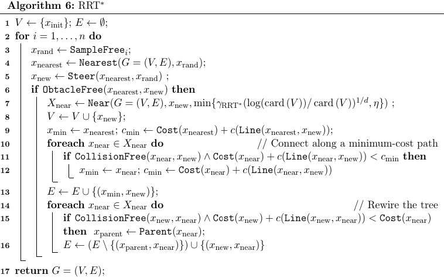

# Nav2-RRT-star
Nasza implementacja algorytmu RRT* bazuje na artykule *Sertac Karaman, Emilio Frazzoli, "Sampling-based Algorithms for Optimal Motion Planning"*.

<p align="center">
  
  <br>
  <i>Pseudokod algorytmu RRT*</i>
</p>

## Opis algorytmu
1. Dodanie punktu startowego do drzewa
```cpp
parent_.clear();
auto start_pt = Point{start.pose.position.x, start.pose.position.y};
parent_[Point{start.pose.position.x, start.pose.position.y}] = std::shared_ptr<Point>{};
```
2. Wylosowanie nowego punktu
```cpp
auto random_pt = get_random_point();
```
3. Znalezienie punktu w drzewie najbliższego wylosowanemu punktowi
```cpp
Point closest_pt = find_closest(random_pt);
```
4. Wybranie punktu oddalenego od nabliższego punktu o ustaloną długość kroku
```cpp
Point new_pt = new_point(random_pt, closest_pt);
```
5. Sprawdzenie, czy połączenie nowo dodanego punktu z innym rodzicem da nam mniejszy koszt
```cpp
double best_cost = calc_cost(start_pt, closest_pt) + 0.1;

for (auto& [key, value] : parent_) {
    if (is_valid(key, new_pt)) {
        double dist = std::sqrt(std::pow((new_pt.x - key.x), 2) + std::pow((new_pt.y, key.y), 2));
        auto new_cost = calc_cost(start_pt, key) + dist;

        if (dist < 1.0 && new_cost < best_cost) {
            closest_pt = key;
            best_cost = new_cost;
        }
    }
}
```
6. Dodanie nowego punktu do drzewa jeśli możliwe jest połączenie go z wybranym w (5.) punktem oraz sprawdzenie czy wcześniej dodane punkty nie będą miał← mniejszego kosztu po połączeniu z nowym punktem.
```cpp
if (is_valid(closest_pt, new_pt)) {
    parent_[new_pt] = std::make_shared<Point>(closest_pt);

    for (auto& [key, value] : parent_) {
        if (is_valid(new_pt, key)) {
            double dist = std::sqrt(std::pow((new_pt.x - key.x), 2) + std::pow((new_pt.y, key.y), 2));
            auto new_cost = calc_cost(start_pt, new_pt) + dist;

            if (dist < 5.0 && new_cost < calc_cost(start_pt, key)) {
                auto nodeHandler = parent_.extract(key);
                nodeHandler.key() = Point{key.x, key.y, new_cost};
                parent_.insert(std::move(nodeHandler));
                parent_[key] = std::make_shared<Point>(new_pt);
            }
        }
    }
```
7. Jeśli jest możliwość połączenia nowego punktu z punktem końcowym, to dodajemy go do drzewa i kończymy algorytm.
```cpp
if (!is_path_found && is_valid(new_pt, Point(goal.pose.position.x, goal.pose.position.y))) {
    auto dist_to_goal = std::hypot(new_pt.x - goal.pose.position.x, new_pt.y - goal.pose.position.y);
    auto goal_point = Point(goal.pose.position.x, goal.pose.position.y, dist_to_goal + new_pt.cost);
    parent_[goal_point] = std::make_shared<Point>(new_pt);
    is_path_found = true;
}
```
8. Po znalezeniu ścieżki, 1000 razy powtarzamy dodawanie nowych punktów, w celu optymalizacji ścieżki.

## Uruchomienie
1. Sklonuj repozytorium do folderu src w workspace'ie ROSa
```bash
cd ~/ros2_ws/src
git clone https://github.com/MikolajZielinski/nav2-RRT-star.git
```
2. Kompilacja
```bash
cd ~/ros2_ws
colcon build --packages-select nav2_RRTstar_planer
source ./install/setup.bash
```
3. Zmiana planera w pliku konfiguracyjnym biblioteki nav2 (/opt/ros/humble/share/nav2_bringup/params/nav2_params.yaml)
```yaml
planner_server:
  ros__parameters:
    expected_planner_frequency: 20.0
    use_sim_time: True
    planner_plugins: ["GridBased"]
    GridBased:
      plugin: "nav2_RRTstar_planner/RRTstar"
      interpolation_resolution: 0.1
```
4. Uruchomienie nav2 za pomocą skryptu startowego
```bash
../src/nav2-RRT-star/start.sh
```
